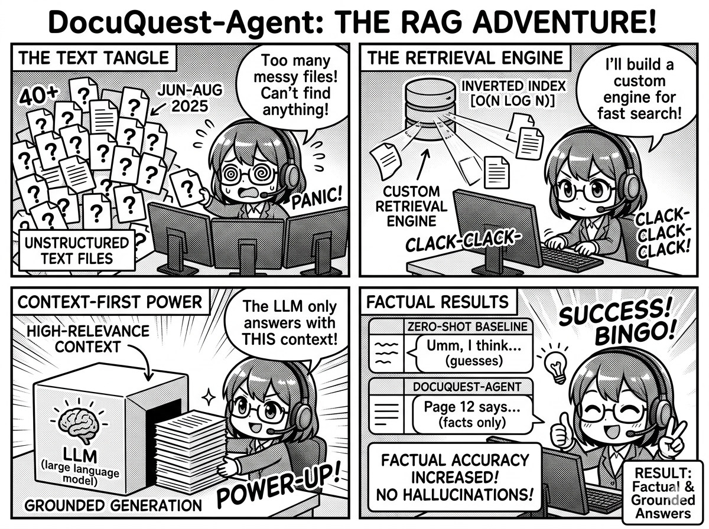

### DocuQuest-Agent

- Developed an end-to-end RAG pipeline that standardizes and processes 40+ unstructured text files; utilized a custom retrieval engine to feed high-relevance context to LLMs, increasing the factual accuracy of generated responses compared to baseline zero-shot models.
- Optimized the retrieval-to-generation bottleneck by implementing an efficient O(N log N) Inverted Index; engineered a "Context-First" retrieval strategy to ensure generated outputs were strictly grounded in the document corpus, effectively eliminating "guesses" and hallucinations. 

Link to Demo: https://docuquest-agent-demo.onrender.com

  

